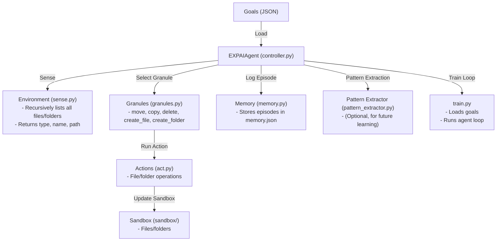

# EXPAI: Minimal File Manipulation Agent

## Overview

EXPAI is a minimal, extensible agent that learns to manipulate files and folders in a sandboxed environment. It is inspired by classic reinforcement learning agents and modular cognitive architectures, such as those seen in early AI research (e.g., SOAR, ACT-R, and modern file-manipulation RL benchmarks). The agent senses its environment, selects actions (granules), executes them, and logs the results for learning.

## Architecture



## Implementation Details

- **Goals**: Defined in `goals/simple_goals.json`, generated from the actual sandbox environment. Each goal describes a file/folder manipulation task (move, copy, delete, create_file, create_folder).
- **Sandbox**: Located in `sandbox/`, contains folders and files the agent can manipulate. The environment is sensed recursively, and all paths are relative.
- **Agent (controller.py)**: Loads goals, senses the environment, selects a matching action granule, extracts arguments in real-time, executes the action, and logs the episode.
- **Granules (granules.py)**: Define available action patterns (move, copy, delete, create_file, create_folder) and map them to functions in `act.py`.
- **Actions (act.py)**: Implement the actual file/folder operations.
- **Memory (memory.py)**: Stores each episode (state, action, result, reward) in `memory.json` for future analysis or learning.
- **Pattern Extractor (pattern_extractor.py)**: Placeholder for future pattern learning from memory.
- **Training Loop (train.py)**: Loads all goals, runs the agent for a configurable number of cycles, and saves granules.
- **Goal/Environment Generation**: `datacreation/populate_sandbox_and_goals.py` scans the sandbox and generates goals to ensure full coverage of all files/folders and actions.

## Setup & Usage

1. **Install Python 3.8+**
2. (Optional) Create a virtual environment:
   ```sh
   python -m venv venv
   source venv/bin/activate  # or venv\Scripts\activate on Windows
   ```
3. **Set up the sandbox and goals:**
   ```sh
   python expai_file_manager/datacreation/populate_sandbox_and_goals.py
   ```
4. **Run training:**
   ```sh
   python expai_file_manager/train.py --cycles 10 --cycles_per_goal 1
   ```
5. **Inspect results:**
   - `memory.json`: All episodes (state, action, reward, etc.)
   - `best_granules.json`: Current set of action patterns

## Results

- The agent can successfully sense, move, copy, delete, and create files/folders in the sandbox.
- Each episode is logged, including before/after environment, action, and reward.
- The architecture is robust to changes in the sandbox and goals, as both are generated dynamically.
- The agent can be extended with more complex learning, pattern extraction, or LLM-based reasoning.

## References & Inspirations

- Classic cognitive architectures: SOAR, ACT-R
- File manipulation RL benchmarks (e.g., BabyAI, MiniWoB++)
- Modular agent design as seen in OpenAI Gym environments

## Extending the Agent

- Add new action types by defining new granules and implementing them in `act.py`.
- Implement pattern extraction and learning in `pattern_extractor.py`.
- Integrate with LLMs or more advanced planners for complex reasoning.

## License

MIT License (see LICENSE file) 
